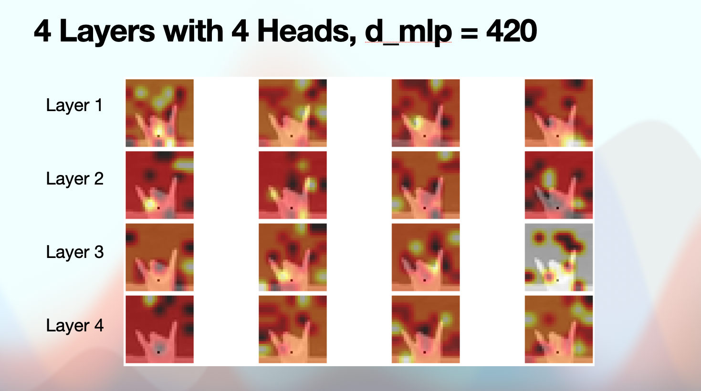

# Vision Transformer Implementation

## Example: ASL Letters
I trained a model to classify American Sign Language letter signs. Choosing that domain was completely random but it turned out to be quite interesting. This is because many ASL letter signs are remarkably similar to eachother, where differences 

As a lightweight example, models have been trained to identify ASL letter signs. This task is relatively difficult due to many letters have nearly identical shapes. In addition to this, the model has a 4x4 patch size, meaning that each patch deals with relatively small amounts of information. 

## Embedding a 28x28 Image
Ground truth pixel values are a decent embedding small images. In the future different embeddings will be used, especially for larger images. 

## Interpreting the ASL Model
Since the original pixels are the input for the model, the activations of the transformer are easy to interpret. Here is a visual of overlaying the attention activations over the original ASL image:

## References
This implementation was inspired by the following papers: [An Image is Worth 16x16 Words](https://arxiv.org/abs/2010.11929) & [TrOCR: Transformer-based Optical Character Recognition with Pre-trained Models](https://arxiv.org/abs/2109.10282).

[This tutorial](https://einops.rocks/1-einops-basics/) helped me understand einops.

[This tutorial](https://www.youtube.com/watch?v=dsjUDacBw8o&list=PL7m7hLIqA0hoIUPhC26ASCVs_VrqcDpAz&index=3) helped me understand the vanilla transformer architecture.
